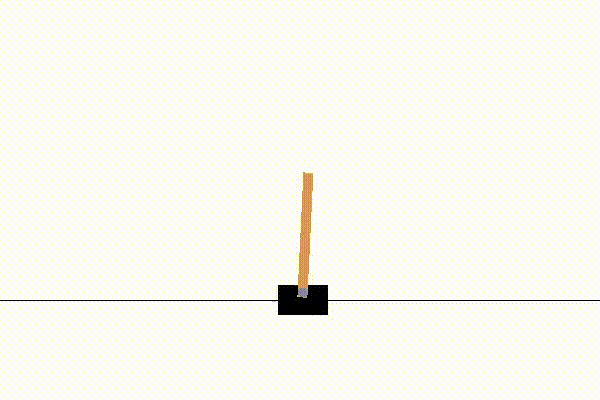
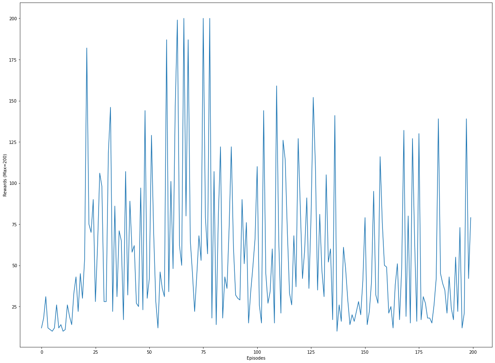

# Solving CartPole using Distributional RL

In this project,I implemented an agent that can learn to control a cartpole using C51 algorithm which is introduced by "A Distributional Perspective on Reinforcement Learning".You can download the paper of C51 from [Lets go to Quora](https://arxiv.org/abs/1707.06887)
</img>

</img>
